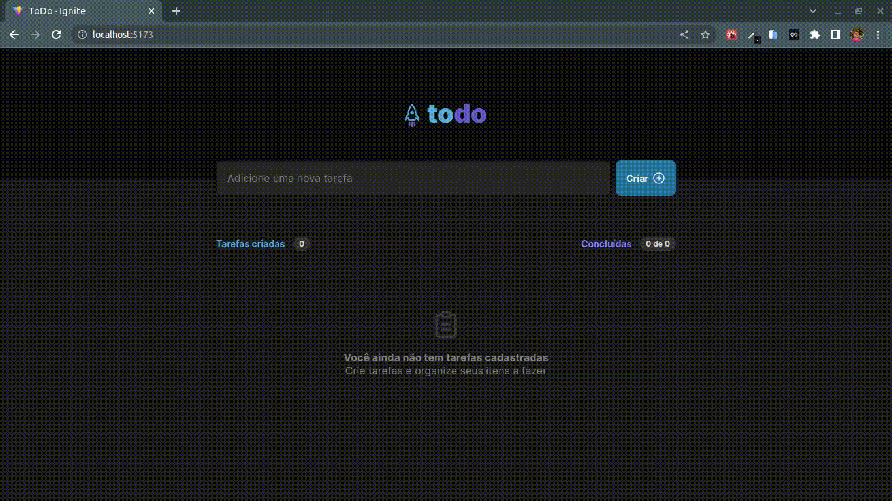

# toDo App

Uma aplicação de gerenciamento de tarefas, para praticar os fundamentos basicos do React.

A aplicação tem por principal objetivo:

1. Adicionar uma tarefa;
2. A cada tarefa adicionada é adicionado +1 ao contado de "Tarefa criadas"
3. É possível marcar uma tarefa como concluida e o contato "Concluidas" é acionado.
4. É possível excluír uma tarefa.

